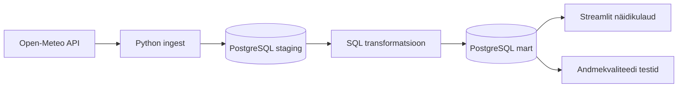

# Näidisprojekt: Tartu ja Tallinna ilmaotsuse näidik

See näidisprojekt ehitab väikese otsast lõpuni andmetöövoo. Projekt loeb Open-Meteo API-st Tartu ja Tallinna ilmaennustuse, salvestab selle PostgreSQL-i, ehitab päevased koondid, kontrollib andmekvaliteeti ja näitab tulemust Streamliti näidikulaual.

## Äriküsimus

Millistel järgmistel päevadel on ilm Tartus ja Tallinnas kõige sobivam välitööde, rattaga liikumise või õues toimuva ürituse planeerimiseks?

Näidikulaud vastab sellele kolme mõõdikuga:

- keskmine päevane temperatuur;
- päevane sademete hulk;
- suurim prognoositud tuulekiirus meetrites sekundis ja sellest tuletatud tähelepanu tase.

## Kuidas projekt täidab nõuded

| Nõue | Kuidas see näidis seda täidab |
|---|---|
| Selge äriküsimus | Ilma sobivus väliste tegevuste planeerimiseks Tartus ja Tallinnas. |
| Ajas muutuv andmeallikas | Open-Meteo ilmaennustus muutub ajas, kui prognoosi uuendatakse. |
| Automatiseeritud sissevõtt | `scripts/run_pipeline.py ingest` teeb API-päringu ja salvestab read andmebaasi. |
| Vähemalt üks transformatsioon | `scripts/01_transform.sql` loob `staging` andmetest `mart` kihi tabelid. |
| Andmekvaliteedi testid | `scripts/02_quality_tests.sql` käivitab 8 kontrolli. |
| Näidikulaud | Streamliti rakendus näitab KPI-sid, joondiagrammi, tulpdiagrammi ja kvaliteediteste. |
| Saladused `.env` failis | Ühenduse seaded tulevad `.env` failist. Repos on ainult `.env.example`. |
| README | See fail kirjeldab äriküsimust, arhitektuuri ja käivitamist. |

## Arhitektuur



Andmekihid:

- `staging` hoiab API-st saadud tunnipõhist lähtekuju;
- `mart` hoiab näidikulaua jaoks valmis dimensiooni, fakti ja päevast koondit;
- `quality` hoiab andmekvaliteedi testide tulemusi.

## Eeldused

Sammud tehakse hosti terminalis ehk selles terminalis, kus saad kasutada `docker compose` käsku.

Vaja on:

- Docker Desktop või muu Docker Compose keskkond;
- ligipääs internetile, et Open-Meteo API-st andmeid lugeda;
- vaba port `55432` PostgreSQL-i jaoks ja `8501` näidikulaua jaoks.

Kui port on hõivatud, muuda `.env` failis väärtusi `DB_PORT_HOST` või `DASHBOARD_PORT_HOST`.

## Käivitamine

Mine näidisprojekti kausta:

```bash
cd project_template/naidisprojekt-ilmaandmed
```

Loo `.env` fail. See fail sisaldab kohaliku arenduskeskkonna seadeid ja seda ei laadita GitHubi.

```bash
cp .env.example .env
```

Käivita teenused:

```bash
docker compose up -d --build
```

Käivita kogu andmetöövoog:

```bash
docker compose exec pipeline python scripts/run_pipeline.py run-all
```

Oodatav tulemus: terminalis on näha, et Tartu ja Tallinna kohta laaditi tunniread, transformatsioon lõppes ning kõik kvaliteeditestid said oleku `passed`.

Kontrolli tulemusi käsureal:

```bash
docker compose exec pipeline python scripts/run_pipeline.py check
```

Ava näidikulaud brauseris:

```text
http://localhost:8501
```

## Töövoo käsud

Kõik käsud käivitatakse hosti terminalis näidisprojekti kaustast.

| Käsk | Mida teeb |
|---|---|
| `docker compose exec pipeline python scripts/run_pipeline.py ingest` | Pärib API-st ilmaandmed ja salvestab need `staging` kihti. |
| `docker compose exec pipeline python scripts/run_pipeline.py transform` | Ehitab `mart` kihi tabelid. |
| `docker compose exec pipeline python scripts/run_pipeline.py test` | Käivitab andmekvaliteedi testid. |
| `docker compose exec pipeline python scripts/run_pipeline.py check` | Näitab viimase laadimise, koondite ja testide ülevaadet. |
| `docker compose exec pipeline python scripts/run_pipeline.py run-all` | Käivitab kogu töövoo õiges järjekorras. |
| `docker compose exec pipeline python scripts/run_pipeline.py reset` | Tühjendab andmetabelid. |

## Andmeallikas

Põhiandmeallikas on [Open-Meteo Forecast API](https://open-meteo.com/en/docs).

Näidis kasutab tunnipõhiseid välju:

- `temperature_2m` ehk õhutemperatuur 2 meetri kõrgusel;
- `precipitation` ehk sademed millimeetrites;
- `wind_speed_10m` ehk tuulekiirus 10 meetri kõrgusel. Open-Meteo vaikimisi ühik on `km/h`, aga näidisprojekt küsib selle välja parameetriga `wind_speed_unit=ms`, et andmebaasis ja näidikulaual oleks väärtus ühikus `m/s`.

API ei vaja selle õppeprojekti jaoks võtit. Kui kasutad sama allikat oma projektis, lisa README-sse andmeallika viide ja järgi Open-Meteo kasutustingimusi.

## Andmekvaliteedi testid

Projekt kontrollib muu hulgas, et:

- viimane edukas laadimine sisaldab andmeid;
- mõlemad asukohad on olemas;
- prognoosi aeg ei puudu;
- sama käivituse, asukoha ja tunni kohta ei teki duplikaate;
- temperatuur, sademed ja tuulekiirus jäävad mõistlikesse piiridesse;
- päevane koondtabel sisaldab näidikulaua ridu.

Testide tulemused salvestatakse tabelisse `quality.test_results` ja on näha ka näidikulaual.

## Failid

| Fail või kaust | Roll |
|---|---|
| `compose.yml` | Käivitab PostgreSQL-i, töövoo konteineri ja Streamliti näidikulaua. |
| `.env.example` | Näitab, milliseid keskkonnamuutujaid projekt vajab. |
| `init/01_create_objects.sql` | Loob andmebaasi skeemid ja tabelid. |
| `scripts/run_pipeline.py` | Orkestreerib API-päringu, laadimise, transformatsiooni ja testid. |
| `scripts/01_transform.sql` | Ehitab `mart` kihi tabelid ja vaated. |
| `scripts/02_quality_tests.sql` | Käivitab andmekvaliteedi kontrollid. |
| `scripts/03_check_results.sql` | Sisaldab käsitsi kontrollimiseks sobivaid SQL-päringuid. |
| `dashboard/app.py` | Streamliti näidikulaud. |
| `docs/arhitektuur.md` | Näidis esimeseks projektinädalaks. |
| `docs/progress.md` | Näidis teise projektinädala edenemisraportiks. |

## Kuidas seda enda projektiks muuta

Baastaseme jaoks piisab, kui muudad järgnevat:

1. vali enda äriküsimus;
2. vaheta API või lisa teine lihtne allikas;
3. muuda `mart.daily_weather_summary` loogikat oma mõõdikute järgi;
4. lisa vähemalt 3 oma andmete jaoks sisukat kvaliteeditesti;
5. kohanda näidikulaud oma mõõdikutele.

Edasijõudnute jaoks sobivad laiendused:

- vii transformatsioonid dbt projekti;
- lisa Airflow DAG, mis käivitab töövoo ajakava järgi;
- asenda Streamlit Supersetiga;
- lisa andmekataloogi kirjeldused ja andmete pärinevuse vaade;
- lisa inkrementaalne laadimine, mis töötleb ainult uue prognoosisnapshot'i.

## Koristamine

Peata teenused:

```bash
docker compose down
```

Peata teenused ja kustuta andmebaasi maht:

```bash
docker compose down -v
```
