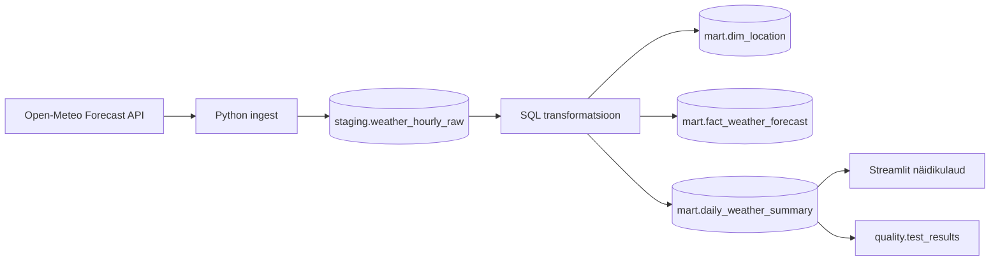

# Arhitektuur

See fail on näidis projektitöö esimese nädala väljundiks. Enda projektis asenda siinne sisu oma teema ja otsustega.

## Äriküsimus

Millistel järgmistel päevadel on ilm Tartus ja Tallinnas kõige sobivam välitööde, rattaga liikumise või õues toimuva ürituse planeerimiseks?

## Mõõdikud

1. Keskmine päevane temperatuur.
2. Päevane sademete hulk millimeetrites.
3. Suurim päevane tuulekiirus ja sellest tuletatud tähelepanu tase.

## Andmeallikad

| Allikas | Tüüp | Muutuvus ajas | Kasutus |
|---|---|---|---|
| Open-Meteo Forecast API | Avalik HTTP API | Prognoos muutub ajas, kui ilmaennustust uuendatakse | Põhiandmevoog |
| Asukohtade nimekiri koodis | Staatiline abiloend | Muutub ainult projekti muutmisel | Dimensiooni täitmine |

Põhiandmevoog tuleb Open-Meteo API-st. Staatiline asukohtade nimekiri on abiallikas, mitte põhiandmeallikas.

## Andmevoog

## Andmebaasi kihid

| Kiht | Roll |
|---|---|
| `staging` | Hoiab API-st saadud tunnipõhiseid ridu võimalikult allikalähedaselt. |
| `mart` | Hoiab näidikulaua jaoks valmis tabeleid ja koondeid. |
| `quality` | Hoiab kvaliteeditestide tulemusi. |

## Tööjaotus

| Roll | Vastutus |
|---|---|
| Andmeallika omanik | Kontrollib API vastust ja kirjutab sissevõtu loogika. |
| Transformatsioonide omanik | Kirjutab `mart` kihi tabelid ja mõõdikute arvutuse. |
| Kvaliteedi omanik | Kirjutab testid ja vaatab läbi ebaõnnestunud kontrollid. |
| Näidikulaua omanik | Ehitab Streamliti vaate ja seob selle äriküsimusega. |

Väikeses grupis võib üks inimene täita mitut rolli.

## Riskid

| Risk | Mõju | Maandus |
|---|---|---|
| API ei vasta või võrgupäring ebaõnnestub | Andmeid ei saa värskendada | Skript annab selge veateate; vajadusel käivita hiljem uuesti. |
| Prognoosi väljade nimed muutuvad | Laadimine katkeb | `validate_hourly_payload` kontrollib nõutud väljade olemasolu. |
| Näidikulaud näitab vanu andmeid | Otsus põhineb aegunud infol | Näidikulaual kuvatakse viimase laadimise aeg. |

## Privaatsus ja turve

Projekt kasutab ainult avalikke ilmaandmeid. Isikuandmeid ei koguta. Andmebaasi kasutajanimi ja parool tulevad `.env` failist. Päris `.env` faili ei tohi reposse lisada.
