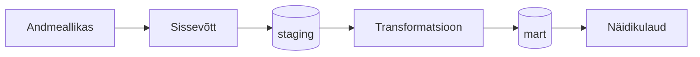

# [GRUPI NIMI] — [PROJEKTI PEALKIRI]

> **Juhend:** Asenda kõik nurksulgudes plankid oma sisuga enne esitamist. Kustuta see juhendrida.

## Äriküsimus

[Kirjelda ühe-kahe lausega, millise andmetega seotud probleemi te lahendate ja kes sellest kasu saab.]

**Mõõdikud:**

1. [Esimene KPI või mõõdik — näiteks: päevane müük poe kohta]
2. [Teine KPI või mõõdik]
3. [Kolmas KPI või mõõdik — vabatahtlik]

## Arhitektuur



Täpsem kirjeldus: [`docs/arhitektuur.md`](docs/arhitektuur.md)

## Andmestik

| Allikas | Tüüp | Uueneb |
|---------|------|--------|
| [Andmeallika nimi] | [API / fail / andmebaas] | [Kui tihti?] |

## Stack

| Komponent | Tööriist |
|-----------|---------|
| Sissevõtt | [Python / Airflow / muu] |
| Transformatsioon | [SQL / dbt / muu] |
| Andmehoidla | PostgreSQL |
| Näidikulaud | [Superset / Streamlit / muu] |
| Orkestreerimine | [Airflow / cron / muu] |

## Käivitamine

```bash
# 1. Klooni repo ja liigu kausta
git clone <repo-url>
cd <projekti-kaust>

# 2. Kopeeri keskkonnamuutujad
cp .env.example .env
# Muuda .env failis paroolid ja muud seaded vastavalt vajadusele

# 3. Käivita teenused
docker compose up -d --build

# 4. [Vabatahtlik: käivita sissevõtt käsitsi esimesel korral]
# docker compose exec pipeline python scripts/run_pipeline.py run-all
```

Airflow (kui kasutatakse): http://localhost:8080 (kasutaja: airflow / parool: airflow)
Näidikulaud: http://localhost:[PORT]

## Andmevoog lühidalt

1. **Sissevõtt** — [Kirjelda, kuidas andmed allikast kätte saadakse]
2. **Laadimine** — Andmed laaditakse `staging` kihti
3. **Transformatsioon** — [Kirjelda peamised arvutused ja mudelid]
4. **Testimine** — [Mitu] andmekvaliteedi testi kontrollivad korrektsust
5. **Näidikulaud** — [Kirjelda lühidalt, mida näidikulaud näitab]

## Projekti struktuur

```
.
├── README.md
├── compose.yml
├── .env.example
├── .gitignore
├── docs/
│   ├── arhitektuur.md      ← nädal 1 väljund
│   └── progress.md         ← nädal 2 väljund
└── ...                     ← ülejäänud projektifailid
```

## Meeskond

| Nimi | Roll |
|------|------|
| [Nimi 1] | [Roll] |
| [Nimi 2] | [Roll] |
| [Nimi 3] | [Roll] |
| [Nimi 4] | [Roll — vabatahtlik] |
