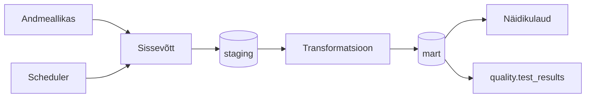

# Arhitektuur

> **Juhend:** See fail on projektitöö esimese nädala väljund. Asenda kõik nurksulgudes plankid oma projekti tegeliku sisuga. Kustuta see juhendrida.

## Äriküsimus

[Kirjuta ühe-kahe lausega oma äriküsimus täpselt. Näiteks: "Millistes kauplustes ja mis kellaaegadel on müügitõhusus (käive külastaja kohta) kõrgeim?"]

## Mõõdikud

1. [Esimene mõõdik — kirjelda, mida arvutate ja kuidas]
2. [Teine mõõdik]
3. [Kolmas mõõdik — vabatahtlik]

## Andmeallikad

| Allikas | Tüüp | Muutuvus ajas | Kasutus |
|---------|------|---------------|---------|
| [Nimi] | [API / CSV / DB] | [Uueneb iga X tundi / päeva] | [Milleks kasutatakse?] |
| [Nimi] | [Staatiline / Dünaamiline] | [Muutub ainult projekti muutmisel] | [Milleks kasutatakse?] |

## Andmevoog

> Täpsusta diagrammi vastavalt oma projektile — lisa rohkem andmeallikaid, mudeleid või teenuseid.

## Andmebaasi kihid

| Kiht | Roll |
|------|------|
| `staging` | Hoiab allika andmeid töötlemata kujul. |
| `mart` | Hoiab transformeeritud ja ärilogikat sisaldavaid tabeleid. |
| `quality` | Hoiab andmekvaliteedi testide tulemusi. |

## Tööjaotus

| Roll | Vastutus | Täitja |
|------|----------|--------|
| Andmeallika omanik | Kirjutab sissevõtu loogika, hoiab API-t töös | [Nimi] |
| Transformatsioonide omanik | Kirjutab mart kihi mudelid ja mõõdikute arvutuse | [Nimi] |
| Kvaliteedi omanik | Kirjutab testid ja vaatab läbi ebaõnnestunud kontrollid | [Nimi] |
| Näidikulaua omanik | Ehitab näidikulaua ja seob selle äriküsimusega | [Nimi] |

## Riskid

| Risk | Mõju | Maandus |
|------|------|---------|
| [Risk 1 — näiteks: API ei vasta] | [Mis juhtub?] | [Kuidas maandad?] |
| [Risk 2] | [Mis juhtub?] | [Kuidas maandad?] |
| [Risk 3] | [Mis juhtub?] | [Kuidas maandad?] |

## Privaatsus ja turve

[Kirjelda, millised isiku- või tundlikud andmed teie projektis esinevad (kui üldse) ja kuidas neid kaitsete. Isikuandmed peavad olema anonümiseeritud. Andmebaasi paroolid peavad tulema `.env` failist.]
